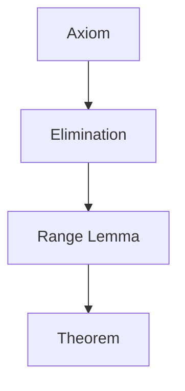
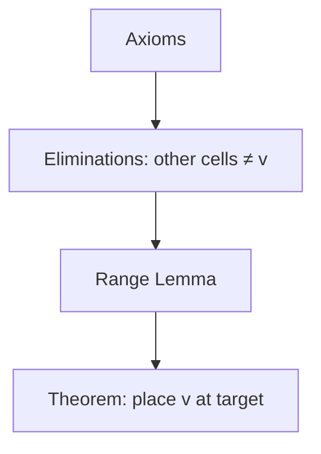
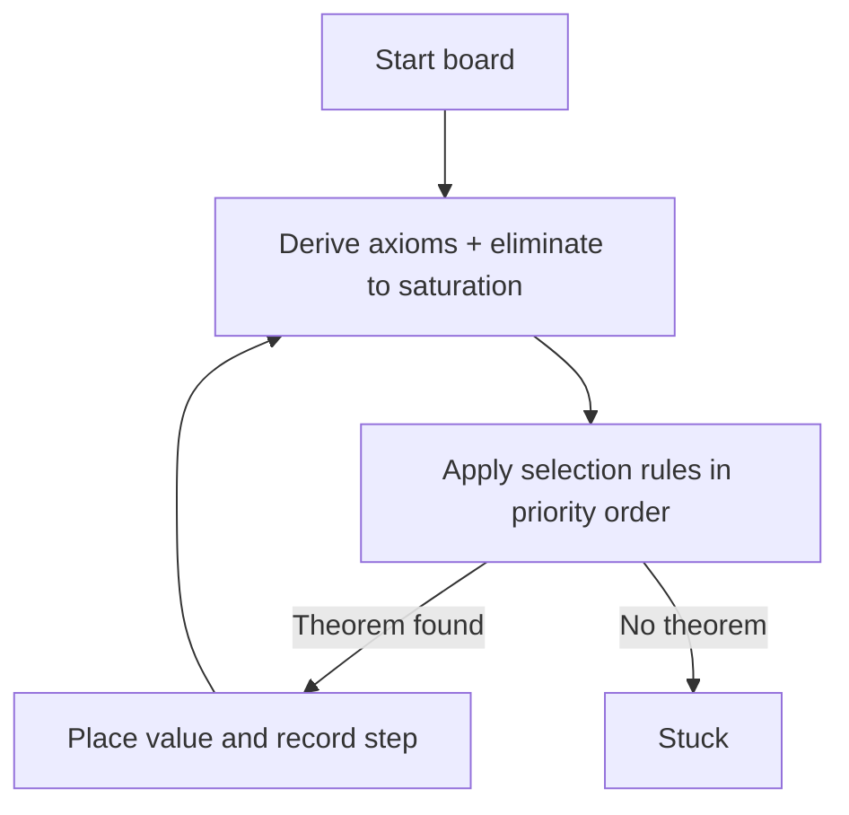

# Design

## Overview

Sudologue is a proof-first Sudoku solver. Every placement is a **theorem** supported by a **proof DAG** that traces back to the given board state. The solver never guesses; if no theorem can be proven, it stops. The only atomic effect is an **elimination**; placements are certificates that all other candidates have already been eliminated.

## Core Propositions

Propositions are immutable facts with explicit premises. Together they form a proof DAG.

**Axiom** — A fact observed directly from the board.

```
Axiom: cell (0,3) = 1    [observed from board]
```

**Elimination (NotCandidate)** — A derived fact that a cell cannot contain a value, justified by premises. This is the **only atomic effect** in the system. In early rules, eliminations are justified directly by axioms; future rules may justify eliminations via lemmas or ranges while preserving the same premise structure.

**Digit alignment invariant:** an elimination `(cell ≠ v)` must be justified by premises that speak about **v** (a placed `v`, or a range/domain statement for `v`).

```
Elimination: (2,3) ≠ 1    [from: (0,3) = 1; shared house: column 3]
```

**Lemma (Domain)** — Remaining possible values for a cell, computed as base domain minus eliminations. This is a derived view used for debugging and legacy narration; rule logic does not depend on Lemma.

```
Lemma: domain of (2,3) = {4}    [from: (2,3) ≠ 1, (2,3) ≠ 2, (2,3) ≠ 3]
```

**RangeLemma (Range)** — Remaining possible cells for a value in a house after eliminations. This is the **first-class** proposition used by all higher-level rules.

```
RangeLemma: range of row 3 for 1 = {(3,3)}    [from: (3,0) ≠ 1, (3,1) ≠ 1, (3,2) ≠ 1]
```

**Candidate** — A possible value for a cell, derived from its domain lemma.

```
Candidate: (2,3) = 4    [from: domain of (2,3) = {4}]
```

**Theorem** — A proven placement selected from already-justified range evidence.

```
Theorem: place 4 at (2,3)    [from: domain of (2,3) = {4}; by naked single]
```

Every proposition is a frozen dataclass that holds its conclusion and premise references. Proofs are implicit in those references.

## Derived Views (Candidates, Domains, Ranges)

Candidates are a **derived view**: a value is a candidate if it has not been eliminated in the current derivation. Candidates are defined over the base domain `v ∈ {1..N}`. Eliminations remove values from this base domain for a specific cell. For narration and proof tooling, candidates are also materialized as `Candidate` propositions derived from domain lemmas.

```
Candidate(cell, v)  <=>  no elimination (cell ≠ v) exists in the derivation
```

From candidates we compute two projections:

```
Domain: domain(cell) = {v | Candidate(cell, v)}
Range:  range(house, v) = {cell in house | Candidate(cell, v)}
```

These views are computed, and Range is materialized as a `RangeLemma` proposition for proof narration. Cell domains are represented as **cell-house ranges**: for each cell and value, `RangeLemma(cell-house, v)` either contains the cell (candidate) or is empty (eliminated). All higher-level rules consume RangeLemmas only.

**Derived-View Interfaces (stable API)**

1. `is_candidate(cell, value) -> bool`
2. `candidates(cell) -> frozenset[int]`
3. `domain(cell) -> frozenset[int]` (alias of `candidates(cell)`)
4. `range(house, value) -> tuple[Cell, ...]`
5. `candidates_in_house(house) -> dict[Cell, frozenset[int]]`

## Proof DAG

Proofs are DAGs, not trees. Shared subproofs are never duplicated.



Each theorem is immutable and tied to the board state at the step it was proven. After a placement, the solver re-derives all propositions from the new board.

## Inference Rules

**Elimination rules** (computed every step, to saturation):

1. **Axiom extraction** — create axioms for all placed values.
2. **Elimination** — for each axiom, eliminate that value from peer cells.
3. **Domain reduction** — for each empty cell, compute its domain lemma.
4. **Range reduction** — for each `(house, value)`, compute its range lemma (including cell-houses).
5. **Box-line reduction** — apply pointing/claiming eliminations from range confinement.

**Selection rules** (priority order, range-only):

1. **Naked single** — for a cell-house, if exactly one value yields a non-empty range, place it. Premises are the cell-house ranges for all other values (empty ranges).
2. **Hidden single** — for each `(house, value)`, compute `range(house, value)`; if it has size 1, place it. Premises should be **targeted eliminations** proving `¬Candidate` for every other cell in the house. `Candidate(target, value)` is implied (can be included in full/strict proofs later).

Further rules are added incrementally as tests demand them.

## Proof Shapes (Rule-Level)

**Naked single (range-first, cell-house)**

```
Theorem(place v at cell)
  <- RangeLemma(range(cell-house, v_i) = ∅) for each excluded value v_i
      <- Eliminations(cell ≠ v_i)
          <- Axioms that justify those eliminations
```

```mermaid
flowchart TD
  A1[Axioms] --> E1[Eliminations for cell]
  E1 --> R1[Cell-house Range Lemmas (excluded values)]
  R1 --> T1[Theorem: place v at cell]
```

**Hidden single (range-first, minimal premises)**

```
Theorem(place v at target)  [hidden single in house H]
  <- RangeLemma(range(H, v) = {target})
     <- Eliminations(other_cell ≠ v) for all other cells in H
        <- Axioms (via house relationships)
```



## Narration Policy

Narration is a policy layer, not rule logic:

1. **Naked single narration** — domain-first: “domain(cell) = {v}”.
2. **Hidden single narration** — range-first by default: “in this house, value v can only go in cell X”.

Styles may override these defaults without changing correctness.

**Verbosity (proof minimization):**

1. **Terse** — theorem + immediate premises only.
2. **Normal** — omit axioms, keep eliminations.
3. **Full** — include axioms (complete proof chain).

The solver can optionally use a scoring hook to choose among multiple theorems produced by a rule (e.g., prefer smaller proofs), without changing rule priority.

## Solver Loop



The solver applies exactly one theorem per iteration, producing a human-paced trace.

## Architecture

All core types are frozen dataclasses. Each step produces a new board rather than mutating in place.

```
Cell(row, col)
House(type, index, cells)
Board(size, cells)
```

Boards validate invariants on construction: no duplicate values in any house and all values within 1..N.

## Future Extensions (Range-First + Minimization)

1. **Advanced rules** — pointing/claiming (done), pairs as explicit structure, X-Wing, Swordfish.
2. **Stable proposition IDs** — propositions can be hashable by `(type, conclusion fields)` to enable de-duplication and proof slicing without relying on instance identity.

## Testing Strategy

Tests use **4x4 boards** for clarity and brevity, scaling to 9x9 for full puzzles.

**Proposition tests** — Verify individual inference rules in isolation:
- Given a board, assert the correct axioms are extracted
- Given axioms, assert the correct eliminations are derived
- Given eliminations, assert the correct domain lemmas are produced
- Given a singleton domain, assert the correct theorem is proven

**Proof tests** — Verify complete derivations for a single placement:
- Given a board, assert the solver proves a specific placement
- Assert the proof chain contains the expected premises

**Full board solve tests** — Complete puzzles verified to solve fully:
```python
def test_4x4_solve():
    board = Board.from_string("0001000230000000", size=4)
    result = solver.solve(board)
    assert result.status == SolveStatus.SOLVED
```

**Progression tests** — As new inference rules are added, puzzles that previously returned `STUCK` should now solve.

## Project Structure

Tests live alongside the code they test. Full board solve tests live in a top-level `puzzles/` directory.

```
sudologue/
    model/
        cell.py              # Cell position
        house.py             # Row, Column, Box; peer/house lookups
        board.py             # Board state, parameterized by size
    proof/
        proposition.py       # Axiom, Elimination, Lemma, Theorem
        engine.py            # Derives propositions from board state
        rules/
            naked_single.py  # Domain = {v} -> place v
            hidden_single.py # Value in only one cell in house -> place
    solver/
        solver.py            # Solve loop: derive -> prove -> place -> repeat
        solve_result.py      # SolveResult, SolveStatus
    narration/
        narrator.py          # Proof chain -> human-readable text
puzzles/
    four_by_four_test.py     # 4x4 full board solves
    nine_by_nine_test.py     # 9x9 solve using singles
```

## Tooling

- **Python 3.12+** — Modern language features without pinning to pre-release runtimes
- **Poetry** — Dependency management
- **pyproject.toml** — Single-file project configuration
- **pytest** — Test framework with coverage via `pytest-cov`
- **pyright** (strict mode) — Static type checking (Pylance-compatible)
- **ruff** — Linting and import sorting
- **black** — Code formatting
- **poethepoet** — Task runner (`poe test`, `poe all`, etc.)
